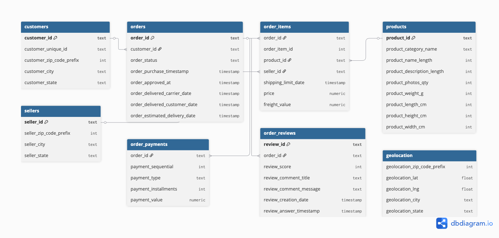

# ShopSmart Analytics – E-commerce Project
# 🛍️ ShopSmart Analytics – E-commerce Project

## 📌 Описание компании
**ShopSmart Analytics** — это аналитический отдел крупного интернет-магазина, специализирующегося на товарах для дома, электроники, одежды и других категорий.  
Как дата-аналитик, я отвечаю за анализ клиентской базы, заказов, товаров и платежей, чтобы улучшить качество сервиса, прогнозировать спрос и повышать удовлетворённость клиентов.  

---

## 📊 ER-диаграмма базы данных
Основная схема (таблицы и связи) построена на основе датасета Olist (Kaggle).  



---

## 🚀 Основная аналитика
Примеры SQL-запросов:  

1. Количество клиентов  
2. Количество заказов  
3. Средний чек заказа  
4. ТОП-10 категорий товаров по выручке  
5. Количество заказов по статусам  
6. Среднее время доставки  
7. ТОП-5 городов по количеству клиентов  
8. Средняя оценка заказов  
9. Количество продавцов  
10. ТОП-5 способов оплаты  

📸 Скриншоты работы:  

  
  
  

---

## ⚙️ Используемые инструменты
- **PostgreSQL** — хранение и обработка данных  
- **Python (psycopg2, pandas)** — подключение к БД и выполнение запросов  
- **pgAdmin 4** — работа с базой и ER-диаграммой  
- **VS Code** — написание кода и организация проекта  
- **GitHub** — хранение и управление версией проекта  
- **Kaggle Dataset**: [Brazilian E-Commerce Public Dataset by Olist](https://www.kaggle.com/datasets/olistbr/brazilian-ecommerce)  

---

## 📂 Структура проекта
ShopSmart-Analytics/
│── data/ # CSV-файлы из Kaggle
│── images/ # ER-диаграмма и скриншоты
│── scripts/ # Python-скрипты
│ └── main.py
│── sql/ # SQL-скрипты
│ ├── schema_postgres.sql
│ └── queries.sql
│── README.md # описание проекта


---

## 📝 Как запустить проект

### 1. Подготовка базы данных
1. Создать базу в PostgreSQL:  
   ```sql
   CREATE DATABASE ecommerce_olist;
Выполнить SQL-схему:

bash

psql -U postgres -d ecommerce_olist -f sql/schema_postgres.sql
Загрузить CSV через \copy:

sql

\copy customers FROM 'data/archive/olist_customers_dataset.csv' CSV HEADER;
\copy orders FROM 'data/archive/olist_orders_dataset.csv' CSV HEADER;
\copy order_items FROM 'data/archive/olist_order_items_dataset.csv' CSV HEADER;
\copy products FROM 'data/archive/olist_products_dataset.csv' CSV HEADER;
\copy sellers FROM 'data/archive/olist_sellers_dataset.csv' CSV HEADER;
\copy order_payments FROM 'data/archive/olist_order_payments_dataset.csv' CSV HEADER;
\copy order_reviews FROM 'data/archive/olist_order_reviews_dataset.csv' CSV HEADER;
\copy geolocation FROM 'data/archive/olist_geolocation_dataset.csv' CSV HEADER;
2. Проверка SQL-запросов
sql

\i sql/queries.sql
3. Запуск Python-скрипта
bash

cd ShopSmart-Analytics
source venv/bin/activate     # активация виртуального окружения
python scripts/main.py
