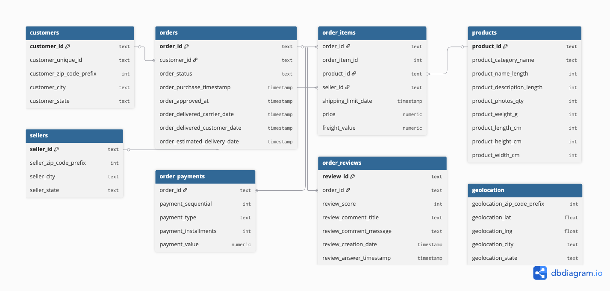

# ShopSmart Analytics – E-commerce Project
# 🛍️ ShopSmart Analytics – E-commerce Project

## 📌 Описание компании
**ShopSmart Analytics** — это аналитический отдел крупного интернет-магазина, специализирующегося на товарах для дома, электроники, одежды и других категорий.  
Как дата-аналитик, я отвечаю за анализ клиентской базы, заказов, товаров и платежей, чтобы улучшить качество сервиса, прогнозировать спрос и повышать удовлетворённость клиентов.  

---

## 📊 ER-диаграмма базы данных
Основная схема (таблицы и связи) построена на основе датасета Olist (Kaggle).  

---

## 🚀 Основная аналитика
Примеры SQL-запросов:  

1. Количество клиентов  
2. Количество заказов  
3. Средний чек заказа  
4. ТОП-10 категорий товаров по выручке  
5. Количество заказов по статусам  
6. Среднее время доставки  
7. ТОП-5 городов по количеству клиентов  
8. Средняя оценка заказов  
9. Количество продавцов  
10. ТОП-5 способов оплаты  

## ⚙️ Используемые инструменты
- **PostgreSQL** — хранение и обработка данных  
- **Python (psycopg2, pandas)** — подключение к БД и выполнение запросов  
- **pgAdmin 4** — работа с базой и ER-диаграммой  
- **VS Code** — написание кода и организация проекта  
- **GitHub** — хранение и управление версией проекта  
- **Kaggle Dataset**: [Brazilian E-Commerce Public Dataset by Olist](https://www.kaggle.com/datasets/olistbr/brazilian-ecommerce)  

---

## 📂 Структура проекта
ShopSmart-Analytics/
│── data/ # CSV-файлы из Kaggle
│── images/ # ER-диаграмма и скриншоты
│── scripts/ # Python-скрипты
│ └── main.py
│── sql/ # SQL-скрипты
│ ├── schema_postgres.sql
│ └── queries.sql
│── README.md # описание проекта

